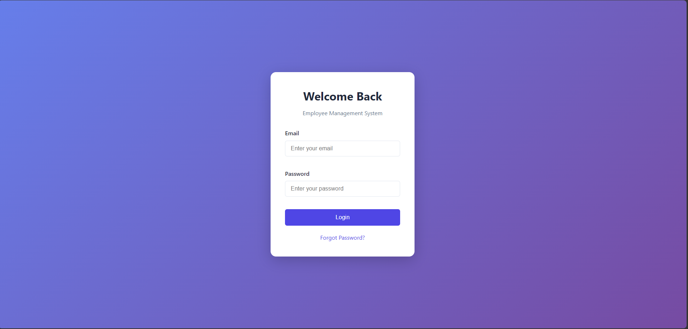
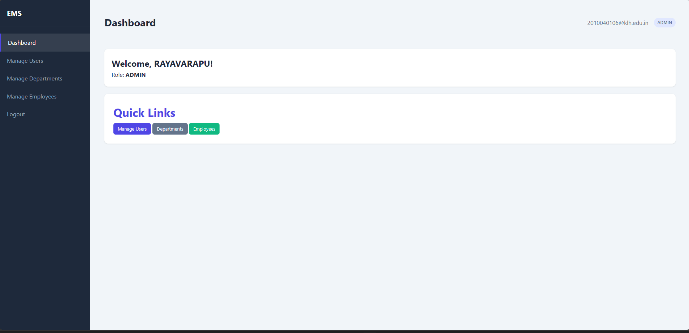
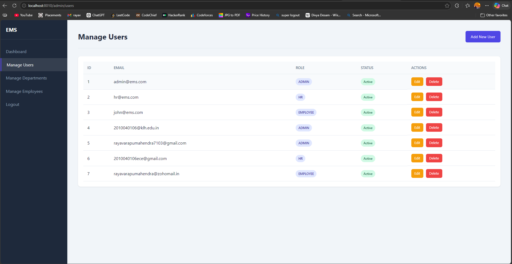
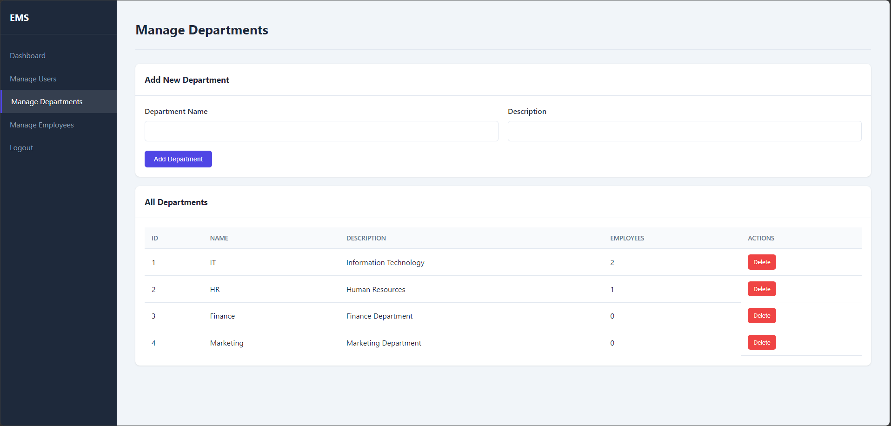
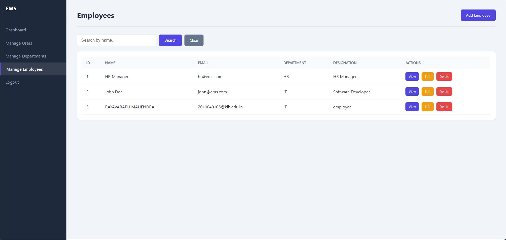
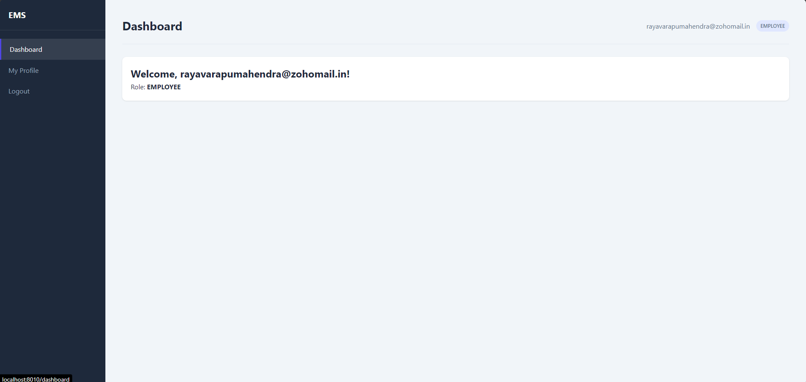
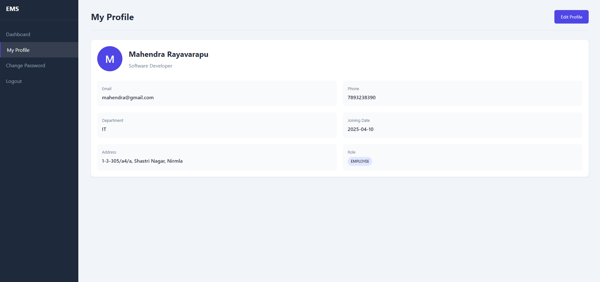
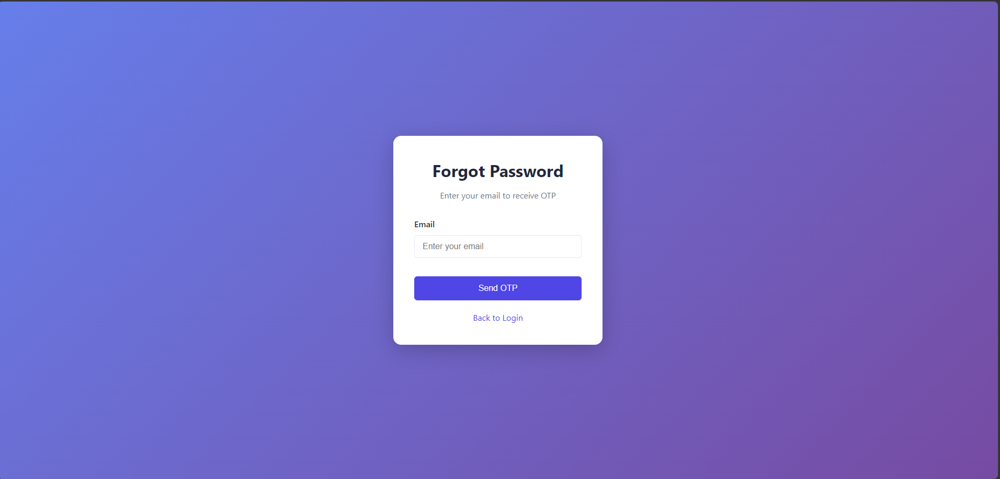
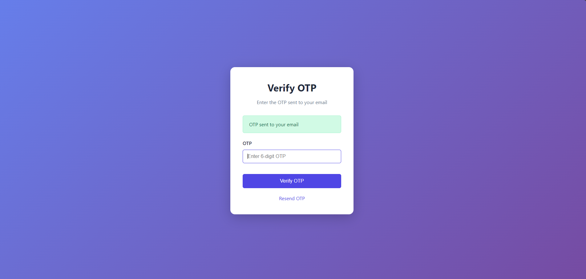

# 🚀 Employee Management System

A secure, role-based Employee Management System with OTP-based password recovery built using Spring Boot.

---

## ✨ Key Highlights
- 🔐 Secure authentication using Spring Security
- 👥 Role-based access (Admin/User/HR)
- 🔑 OTP-based Password Reset via Email
- 🌐 Server-side rendered UI using Thymeleaf
- 🧩 Layered architecture (Controller, Service, Repository)
- ✅ Form validation for data integrity
- 🗄️ Database integration with MySQL

---

## 🛠 Tech Stack
- Java
- Spring Boot
- Spring Security
- Spring Data JPA (Hibernate)
- MySQL
- Thymeleaf
- Maven

---

## 📸 Screenshots

### 🔐 Login Page

### 🛠 Admin Dashboard

### 👥 Manage Users

### 🏢 Manage Departments

### 👨‍💻 Manage Employees

### 👤 Employee Dashboard

### 🙍 Profile Page

### 🔑 Forgot Password

### 🔐 OTP Verification

---

## 🧠 Architecture

This project follows a layered architecture:

- **Controller Layer** → Handles HTTP requests & responses  
- **Service Layer** → Contains business logic  
- **Repository Layer** → Interacts with database using JPA  
- **DTO Layer** → Transfers data between layers  
- **Entity Layer** → Represents database tables  
- **Configuration Layer** → Security & application configs  

---

## 🔐 Authentication & Authorization
- Implemented using Spring Security  
- Role-based access control:
  - **Admin** → Full access  
  - **User** → Limited access  

---

## 🔗 API Endpoints (Sample)

| Method | Endpoint              | Description            |
|--------|----------------------|------------------------|
| GET    | /employees           | Get all employees      |
| POST   | /employees           | Add employee           |
| PUT    | /employees/{id}      | Update employee        |
| DELETE | /employees/{id}      | Delete employee        |

---

## ⚙️ How to Run

1. Clone the repository  
2. Open in IntelliJ / STS  
3. Configure MySQL in `application.properties`  
4. Create database manually  
5. Run the Spring Boot application  
6. Open browser: http://localhost:8010  

---

---

## 🚧 Future Improvements
- Implement JWT-based Authentication
- Add Pagination & Sorting
- Enhance Search functionality
- Convert application to RESTful API architecture
- Integrate Swagger for API documentation
- Deploy application (AWS / Render)

---

## 📌 Author
**Mahendra Rayavarapu**
